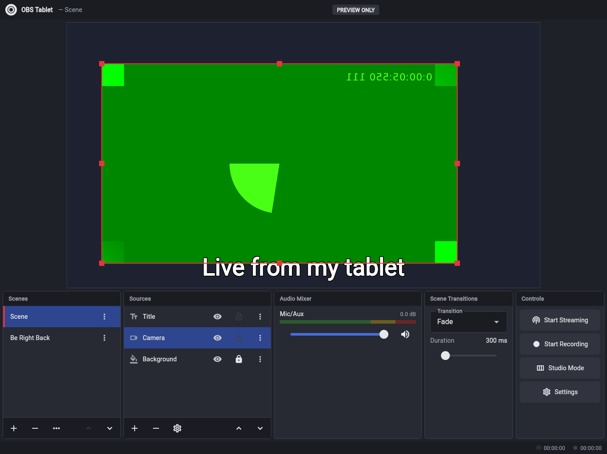
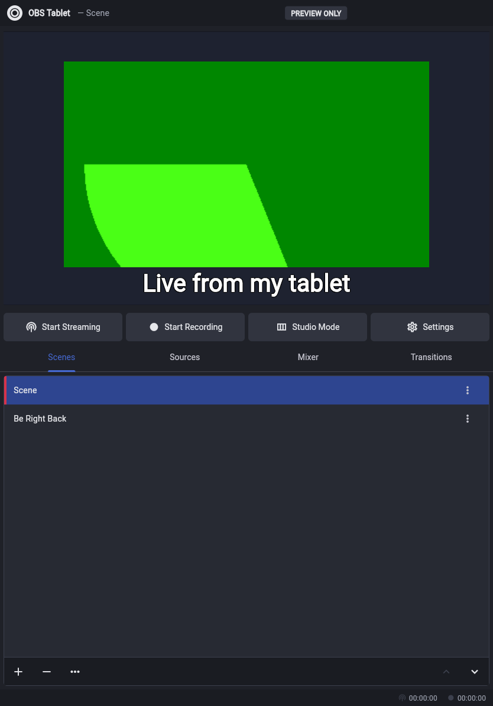
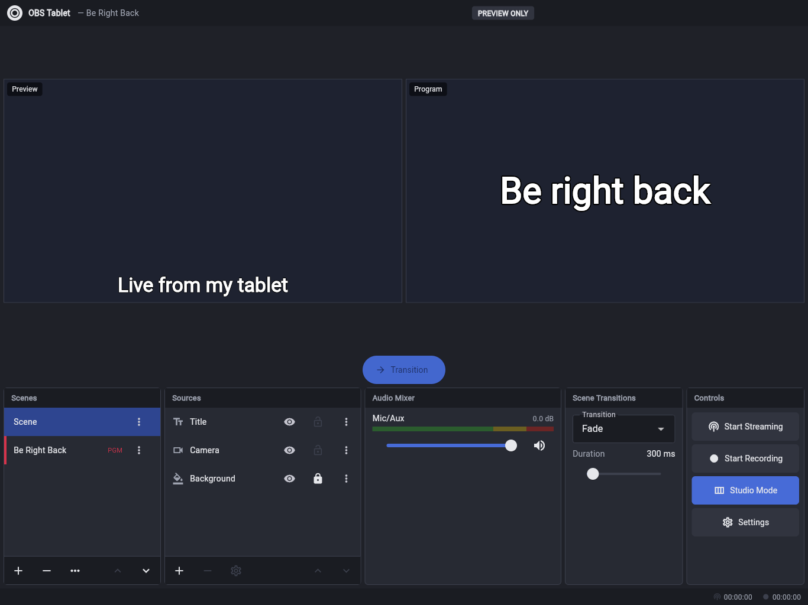
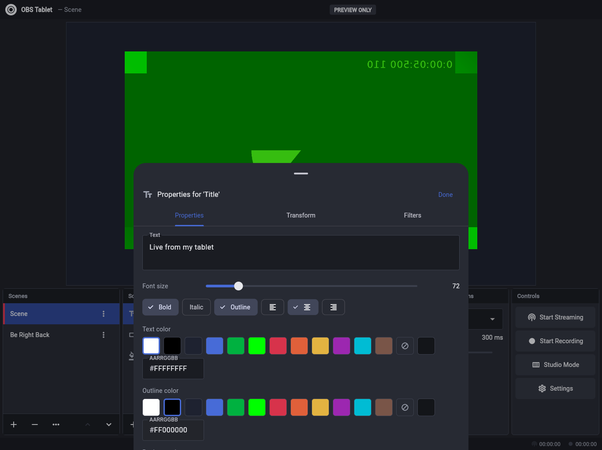

# OBS Tablet

A touch-first live streaming and recording studio for **Android tablets and iPads**, modelled on
[OBS Studio](https://github.com/obsproject/obs-studio). It's built with Flutter: one codebase for both
platforms, plus a small native encoder layer.

OBS Studio itself can't simply be recompiled for tablets. It is about a million lines of C/C++ built on Qt
and depends on desktop-only APIs (desktop GPU backends, FFmpeg, OS window and display capture). This project
is a fresh implementation of OBS's concepts and workflow, designed for fingers instead of a mouse.

| Landscape tablet: editing a source | Portrait tablet |
| --- | --- |
|  |  |
| **Studio Mode: preview and program** | **Source properties** |
|  |  |

_Screenshots are from the browser build, using Chromium's synthetic test camera as the video source._

## Features

**Scenes and sources, OBS-style**
- Scenes with add, rename, duplicate, remove and drag to reorder.
- Global sources shared across scenes ("Add existing"), just like libobs.
- Source types:
  - Video Capture Device (front, back or USB camera)
  - Screen Capture: the whole device screen, including games and other apps, plus their sound
  - Image
  - Media Source (looping video)
  - Text (font size, bold, italic, outline, colors, alignment)
  - Color Source
  - Audio Input Capture (microphone)
- Per item: visibility, lock, ordering (top, up, down, bottom) and duplicate.
- Transform: position, size, rotation, crop, flip, and fit mode (stretch, fit, fill).
- Transform presets: Fit to Screen, Stretch, Center, Rotate 90° and others.
- Filters: color correction (opacity, brightness, contrast, saturation).

**Touch canvas editing**
- Tap to select. Drag to move, with snapping to canvas edges and center.
- Pinch to scale and twist to rotate, with 90° snapping.
- Resize handles sized for fingers. Corners keep the aspect ratio.
- Long-press for the full item menu.

**Live production**
- Studio Mode: edit the Preview, then press Transition to send it to Program.
- Transitions: Cut, Fade, Slide, Swipe, Fade to Black, with adjustable duration.
- Audio mixer with logarithmic faders, dB readout, mute, and green/yellow/red level meters.
- Status bar shows LIVE and REC timers, bitrate, FPS and dropped frames.

**Output**
- Streaming over RTMP and RTMPS. Presets for Twitch, YouTube, Facebook and Kick, or any custom
  `rtmp://` / `rtmps://` server.
- Auto-reconnect: up to 10 attempts, 5 s apart.
- Congestion handling: drops video frames until the next keyframe, like OBS.
- Streaming and recording can run at the same time and share one hardware encoder.
- Recording to MP4, saved to the gallery (`Movies/OBS Tablet` on Android, Photos on iPad), or to FLV,
  which is crash-safe like OBS's MKV.

**Screen capture (stream your games)**
- Add a Screen Capture source, tap ▶ next to it in Sources, and accept the system prompt. Then switch to
  any app or game.
- The stream keeps running in the background. Sources above the screen (camera, text, logos) stay on top
  of it; sources below show through around it.
- Other apps' audio is captured too, with its own fader in the mixer. On Android this needs Android 10+;
  on iPad it comes from the ReplayKit broadcast.
- While the studio itself is open, the screen source shows a status card instead of a mirror of the app.
  Cameras freeze while you're in another app, because both Android and iPadOS pause camera access in the
  background.
- Settings for output resolution, FPS, video and audio bitrate, and keyframe interval.
- Keeps the screen awake while live.

Scene collections and settings are saved automatically, and can be exported as JSON.

## Architecture

```
lib/
  core/       Scene model (Source, Scene, SceneItem, transforms), StudioController, persistence
  render/     Compositor (SceneCanvas), Program view with transitions, touch editor, camera/media services
  output/     Output engine, pure-Dart RTMP/RTMPS client, FLV muxer, AMF0, H.264/AAC packaging
  ui/         Docks (Scenes, Sources, Mixer, Transitions, Controls), properties sheet, settings
android/app/src/main/kotlin/…   MediaCodec H.264 + AAC, MediaMuxer MP4, MediaProjection screen capture
ios/Runner/                     VideoToolbox H.264, AVAudioEngine + AAC, AVAssetWriter MP4, socket server
ios/BroadcastExtension/         ReplayKit screen broadcast: composites and encodes the screen
ios/Shared/                     Code shared by app + extension: H.264 encoder, Core Image compositor, link
scripts/ios_setup_project.rb    Adds the extension target to the Xcode project (idempotent)
```

The output pipeline:

```
Program canvas (Flutter)  ──frame pump──▶  native H.264 encoder ──┐
Microphone (native)       ──────────────▶  native AAC encoder  ───┤ encoded packets
                                                                  ▼
                         ┌──────────── AvPackager ───────────┬──────────────┐
                         ▼                                   ▼              ▼
                 RTMP/RTMPS publisher (Dart)         FLV file (Dart)   MP4 (native MediaMuxer)
```

**Screen capture.** When the program scene contains a Screen Capture source, the program view is split
into the layers *under* and *over* the screen. Dart captures those two layers: layers with a camera or
video refresh at about 15 fps, and static layers only when they change. Native code puts the live screen
between them for every output frame. That native compositor keeps running while another app is in
front, which Flutter can't do.

- **Android:** a foreground service owns the MediaProjection, and the video encoder composites the
  layers itself.
- **iPad:** iPadOS doesn't allow an app's hardware video encoder to run in the background. So the
  *broadcast extension* composites and encodes, and sends H.264 packets and the game audio to the app
  over a Unix socket in a shared App Group container. The app stays alive in the background through its
  audio session, and handles the microphone, RTMP and recording.

Most of the streaming logic (RTMP handshake, chunking, AMF0, FLV, H.264/AAC packaging) is written in
plain Dart. That makes it fully testable, and the same code serves both Android and iPad. Each platform
only needs a thin native encoder that turns RGBA frames and microphone audio into H.264/AAC packets.

## Building

Requirements: Flutter 3.41+ (stable). Building for Android needs Android Studio/SDK; building for iPad
needs a Mac with Xcode.

```bash
flutter pub get
flutter run                 # on a connected tablet
flutter build apk           # Android
flutter build ios           # iPad (open ios/Runner.xcworkspace to sign)
flutter build web --no-web-resources-cdn   # browser preview of the UI (no streaming)
```

### iPad signing

The screen broadcast extension shares an **App Group** (`group.org.obstablet.obsTablet`) with the app.
In Xcode, select your team for both the **Runner** and **BroadcastExtension** targets. If you change the
bundle ID, use your own group name in `ios/Shared/ObsLink.swift` and in both `.entitlements` files.
Everything else works without the App Group; only screen capture needs it.

Every push also builds an installable Android APK in GitHub Actions. Download it from
**Actions → Build → obs-tablet-android-apk**.

## Testing

```bash
flutter test
```

- Unit tests cover the scene model and controller: studio mode, shared sources, ordering, presets,
  persistence.
- Output tests cover AMF0, RTMP chunking (all header types, extended timestamps), URL parsing, Annex-B
  parsing and AAC config.
- Widget tests render the landscape and portrait tablet layouts, scene switching, Studio Mode, canvas
  dragging and settings.
- `test/rtmp_integration_test.dart` streams real H.264 and AAC to a live RTMP server (ffmpeg in
  listen mode), then checks the recorded stream with ffprobe. It is skipped if ffmpeg isn't installed.

## Status and roadmap

| Area | Status |
| --- | --- |
| Scene editing, compositor, transitions, Studio Mode, mixer UI, settings, persistence | ✅ Done, tested |
| RTMP/RTMPS streaming client, FLV packaging | ✅ Done, verified end to end against an RTMP server |
| Android native encoder (H.264/AAC, MP4 recording, gallery export) | ✅ Builds in CI; needs testing on real devices |
| Android screen capture + app audio | ✅ Builds in CI; needs testing on real devices |
| iPad native encoder, MP4 to Photos, screen broadcast extension | ✅ Written; compiled by the macOS CI job; needs testing on a real iPad |
| Browser source, chroma key, more filters, hotkeys/Stream Deck, multiple audio tracks | Planned |
| Zero-copy GPU frame path (avoid reading RGBA back to the CPU) | Planned. Current path suits 720p30 on recent tablets |

## Credits

Inspired by [OBS Studio](https://obsproject.com) (GPL-2.0). This project contains no OBS source code;
it reimplements the concepts and workflow for tablets.
